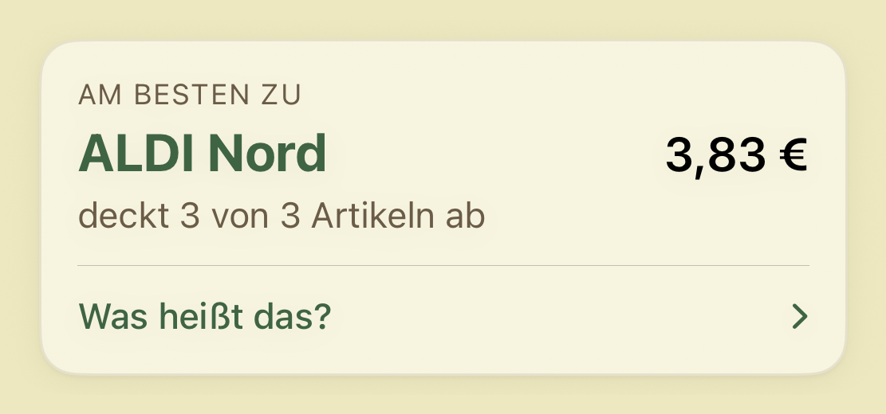
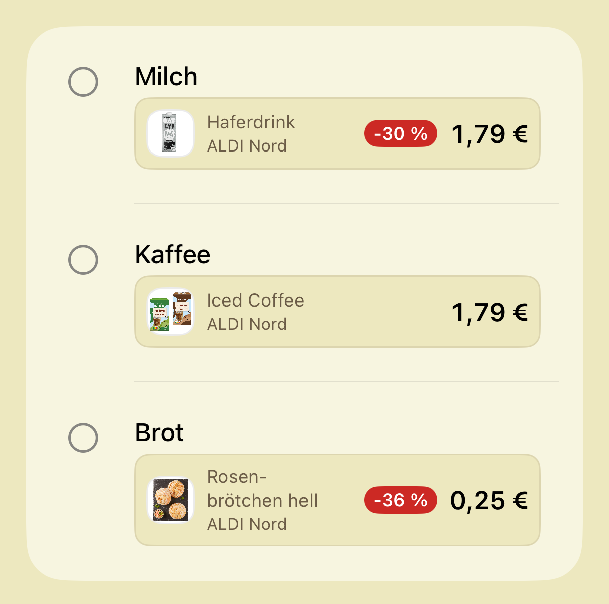

<p align="center">
  
</p>

<h1 align="center">Le Chariot</h1>

<p align="center">Write a shopping list. Find out which of your shops covers it cheapest this week.</p>

<p align="center"><sub>iOS 17+ · SwiftUI, no third-party dependencies · <a href="LICENSE">MIT</a></sub></p>

<p align="center">
  
</p>

Every German supermarket publishes a weekly leaflet, and comparing them by hand is
miserable — eight apps, eight layouts, and by the time you've checked the fourth one
you've forgotten what Kaufland wanted for butter. So: type what you need, pick the
branches you'd actually drive to, and Le Chariot names the single shop that covers the
most of your list for the least money.

That card is a real run in Dresden, not a mockup — seven branches selected around 01219,
three things on the list, ALDI Nord taking all three for 3,83 €.

The UI is German and the offers are German. Nothing here is portable to another country,
and I'm not pretending otherwise.

## The interesting part is the matching

<p align="center">
  
</p>

You type "Milch". The offer is called "SACHSEN MILCH Buttermilch 500 g". Getting from one
to the other is where the actual work lives, and it runs in two stages
([`OfferMatcher.swift`](ios/LeChariot/Models/OfferMatcher.swift), 105 lines):

1. **Direct** — every query token must hit a token in the product title. Typo-tolerant
   via Levenshtein distance ≤ 1, but only when both tokens are ≥ 5 characters *and*
   differ in length. The guards matter: without them "Käse" matches "Kekse" and "Butter"
   matches "Bitter". Ask me how I know.
2. **Category** — the query is looked up against `match_key` tags the backend attaches
   during import. The backend dictionary already blocks false composites, so Tomatenmark
   carries no `tomaten` tag and won't turn up when you ask for tomatoes.

"Brot" landing on Rosenbrötchen above is stage two doing its job. It is still wrong
sometimes — there's a feedback path in the app for bad matches
([`MatchFeedbackStore`](ios/LeChariot/Stores/MatchFeedbackStore.swift)), and I go through
the rejections periodically and fold them back into the dictionary.

## Where the data comes from

Offers are scraped by the Rust backend in
[lechariot-backend](https://github.com/Scxttk/lechariot-backend) and pushed to Supabase;
this repo only reads. All eight chains come from the retailers themselves — seven via
their own endpoints (Kaufland, REWE, Netto, Penny, EDEKA, ALDI Nord, ALDI SÜD), Lidl via
its weekly leaflet PDF (`LIDL_SOURCE=prospekt`; the third-party Marktguru API remains
only as the code's fallback when that variable is unset).

Branch lists are real too. Enter a postcode and you get actual nearby stores with
distances — 01219 turns up 27 ALDI Nord branches, nine Kauflands, and a Penny 300 m away.

## Structure

- `ios/` — SwiftUI iOS app (iOS 17+, no third-party dependencies)
- `docs/` — data contracts and architecture notes
- `tools/` — one-off generators; `icon.swift` draws the three app-icon
  variants from the proportions at the top of the file
  (`swiftc -O tools/icon.swift -o /tmp/icon && /tmp/icon ios/LeChariot/Assets.xcassets/AppIcon.appiconset/`)

## iOS setup

You'll need XcodeGen — the `.xcodeproj` is generated, not the source of truth.

1. `brew install xcodegen` ([XcodeGen](https://github.com/yonaskolb/XcodeGen))
2. Copy `ios/LeChariot/Resources/APIKeys.example.plist` to `ios/LeChariot/Resources/APIKeys.plist` and fill in the Supabase publishable key.
3. Regenerate the project if `project.yml` changed: `cd ios && xcodegen`
4. Build:

```sh
xcodebuild -project ios/LeChariot.xcodeproj -scheme LeChariot -destination 'generic/platform=iOS Simulator' build
```

## Data contracts

See [docs/CONTRACTS.md](docs/CONTRACTS.md).
