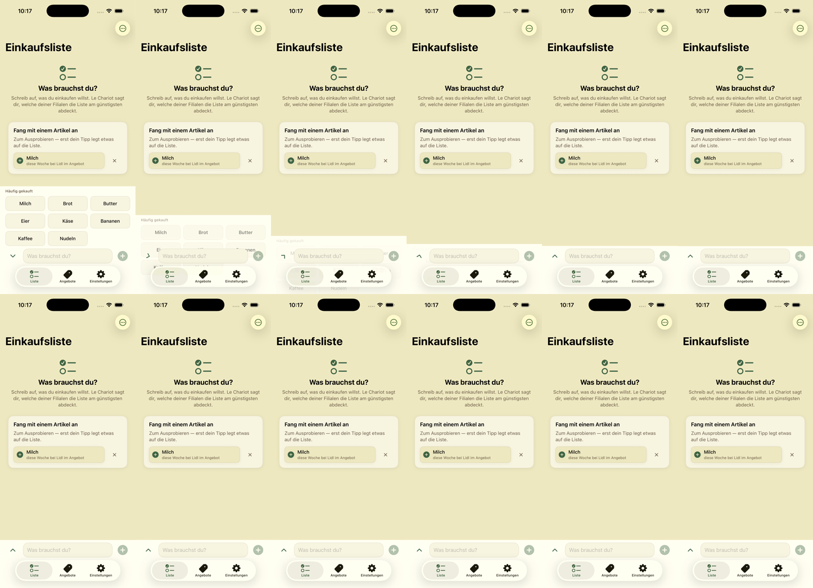
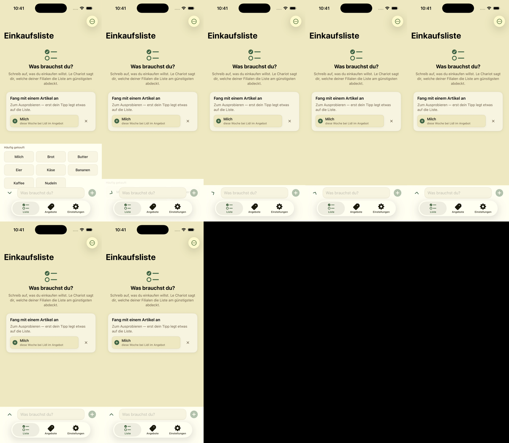
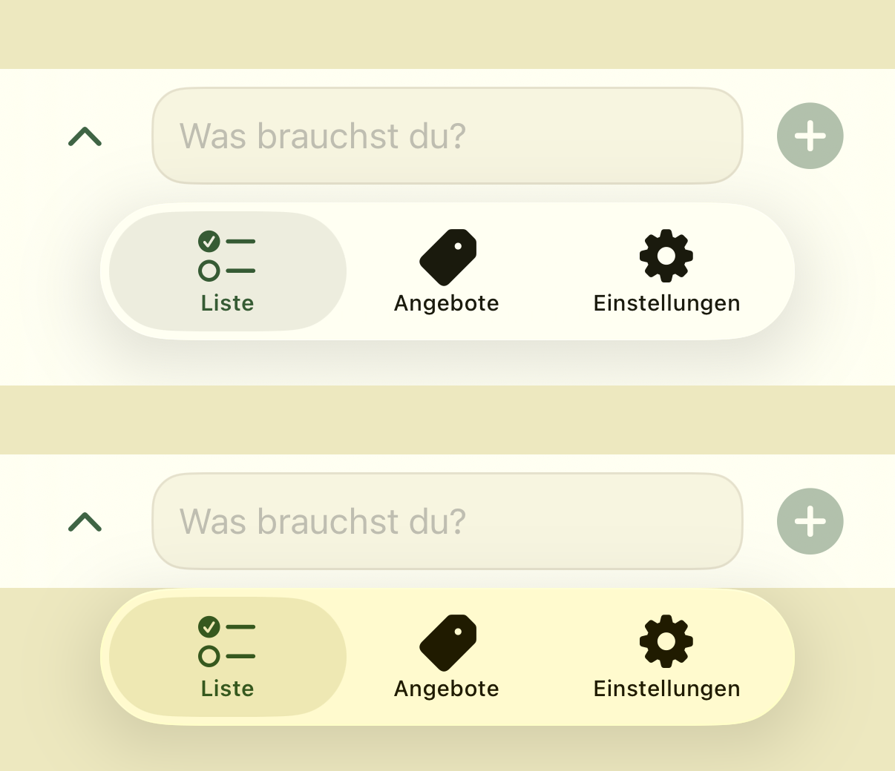

# Ruckler-Audit, 06.08.2026

Scotts Meldung: „viele grafische Fehler, nicht flüssige oder schlecht
aussehende Animationen." Wie am 02.08. gilt: **erst der Ort, dann die
Ursache, dann der Fix.** Neu ist diesmal das Werkzeug, mit dem der Ort
gefunden wurde.

## Warum `tools/perf.sh` diesen Befund nicht finden konnte

Der Messstand vom 02.08. zählt CPU-Zeit, Instructions und Speicher. Damit hat
er zwei Ursachen widerlegt (Prospektlänge, Rundgang-Maske) und **keine
gefunden** — und das war kein Zufall, sondern die Bauart: Ein Ruckler ist kein
Mittelwert. Die Geisterkacheln unten kosten **null** zusätzliche CPU-Zeit. Sie
sind ein Zeichenfehler, kein Rechenfehler.

Dazu kommt `tools/jank-probe.sh`: Der Simulator nimmt auf, und die Aufnahme
wird Bild für Bild ausgewertet. Die Aufnahme ist **variabel getaktet** — der
Simulator schreibt nur ein Bild, wenn sich etwas geändert hat. Damit *sind* die
Bilder die Bewegung, und eine Lücke im Zeitstempel ist Stillstand. Ein Übergang
findet sich so von selbst, ohne dass jemand mitstoppt.

> **Eine Falle, in die der erste Anlauf gelaufen ist.** Das Stück wurde zuerst
> auf feste 60 fps umkodiert. Danach maß die Auswertung h264-Rauschen: Ein
> **stehender** Bildschirm kam auf 3,2 Graustufen mittlere Differenz und sah
> aus wie Dauerbewegung. Alle Zahlen unten laufen direkt auf der Aufnahme, ohne
> Neukodierung. (Dieselbe Lektion wie bei der Trailer-Pipeline, andere
> Richtung.)

⚠️ **Die Maschine war belegt** (WindowServer ~45 %, Claude ~23 %, Côte d'OS
~17 %). Für die Zahlen hier ist das folgenlos: Gemessen werden **Zeitpunkte
und Pixel in einer Aufnahme**, keine CPU-Zeiten. Ein langsamerer Rechner
verschiebt keine Animationsdauer, die SwiftUI selbst vorgibt.

---

## Rangliste

### 1. ⛔️ Geisterkacheln — bestätigt, Ursache gefunden, behoben

**Gemessen.** Zuklappen von „Häufig gekauft", Bild für Bild:

| Ausschnitt | Bewegung | Spitze |
|---|---:|---:|
| Kachelbereich | 0,050 .. 0,147 s | 10,6 |
| Eingabezeile | 0,050 .. 0,598 s | 9,4 |
| **Tab-Leiste** | **0,165 .. 0,317 s** | **1,0** |

Die dritte Zeile ist der Fund. **In der Tab-Leiste hat nichts zu passieren** —
sie klappt nicht mit. Dass sich dort 0,15 s lang etwas bewegt, heißt: Es wird
etwas darüber gezeichnet, das nicht dorthin gehört.

Der Kontaktabzug zeigt es: Die Kacheln laufen **über die Eingabezeile hinweg**
und stehen als durchsichtige Reste über der Tab-Leiste, außerhalb jeder Fläche,
zu der sie gehören.



Bild 2 und 3 der oberen Reihe: „Eier / Käse / Bananen" liegen quer über der
Eingabezeile, „Kaffee / Nudeln" stehen **unter** ihr auf der Tab-Leiste.



**Die Ursache ist nicht die Bewegung, sondern der fehlende Rand.**
`stapleSurface` geht mit `.move(edge: .bottom)` — die Richtung wurde am 03.08.
schon einmal gegen genau diese Geister gebaut, und sie ist richtig. Nur hat
`bottomBar` **keine Schnittkante**: Was unten hinausfährt, zeichnet SwiftUI
weiter. Die Reparatur von damals hat die Richtung repariert und den Rand
übersehen.

**Behoben** mit `.clipped()` auf dem Block.

> **Die Reihenfolge ist der ganze Fix, und der erste Anlauf hatte sie falsch.**
> `.background(.bar).clipped()` schnitt die Fläche mit ab: Der helle Balken
> endete unter der Eingabezeile, und die **Tab-Leiste stand plötzlich auf dem
> gelben App-Hintergrund** statt auf dem Balken — am Screenshot A/B belegt, ein
> sichtbarer Rückschritt gegen einen unsichtbaren Fehler. Geschnitten wird der
> **Inhalt**, hinterlegt wird **danach**: `.clipped().background(.bar)`.
>
> 
>
> Oben die Ausgangslage, unten der falsche erste Anlauf: Die Tab-Leiste sitzt
> auf Gelb statt auf dem hellen Balken.

**Gegenprobe:** Tab-Leisten-Bereich **ohne jede Bewegung**, Spitze 1,04 → 0,13
(unter der Rauschschwelle). Balken und Tab-Leiste im Standbild deckungsgleich
mit vorher.

### 2. ⛔️ Die Vorschlagsfläche lief mit doppelter Dauer — behoben

**Gemessen.** Das Zuklappen brauchte **0,548 s**. `Theme.Motion` gibt einem
Element **0,22 s**, und 0,5 s ist im Code selbst als die Grenze notiert, ab der
ein Übergang sich wie Warten anfühlt. Der Streifen lag also genau darauf.

**Die Ursache steht in einem einzigen fehlenden Argument:** `surfaceToggle`
rief `withAnimation(.snappy)` — **ohne Dauer**. Das ist nicht die Hausregel,
das ist SwiftUIs Vorgabe, und die liegt bei ~0,5 s. Die Kurvenfamilie war schon
richtig; nur die Zahl kam aus der falschen Quelle. Genau deshalb ist es
niemandem beim Lesen aufgefallen — `.snappy` *sieht* aus wie `Theme.Motion`.

**Behoben:** `withAnimation(Theme.Motion.element.animation(reduceMotion:))`.
Damit hängt auch „Bewegung reduzieren" endlich dran; vorher lief die Fläche
unabhängig von der Einstellung.

**Gegenprobe, dieselbe Strecke, dieselbe Sitzung:**

| Stand | Dauer |
|---|---:|
| Ausgangslage | 0,548 s |
| nur Schnittkante | 0,385 s |
| **Schnittkante + `Theme.Motion`** | **0,203 s** |

Die mittlere Zeile ist kein Zufall: Ein Teil der gemessenen „Dauer" war die
Kachel, die noch durch die Eingabezeile lief. Erst der Rand macht die Zahl
ehrlich, dann korrigiert die Regel sie.

### 3. ✅ Die Rundgang-Abdunklung ist **nicht mehr schwarz** — widerlegt, nichts zu tun

Der Auftrag nennt den Feldtest vom 03.08.: Tab-Wechsel dunkelt ~0,5 s
vollständig ab, mittlere Helligkeit 0,04. **Auf `main` ist das nicht mehr so.**

Gemessen am Wechsel in die Einstellungen, mittlere Bildhelligkeit:

- Dunkelster Punkt: **0,200** (gemeldet waren 0,04)
- **Nie** unter 0,15
- Ablauf 0,00 → 0,23 abblenden, 0,23 → 0,34 halten, 0,34 → 0,51 aufblenden

Das deckt sich auf die Hundertstel mit `TourTabTransition.standard`
(0,15 / 0,10 / 0,20). Der Fix vom 03.08. — die Abdunklung unter die Karte
statt über alles — **hält**. Die Karte bleibt stehen und trägt die Helligkeit;
genau das war die Absicht.

**Hier war nichts zu reparieren, und das ist der Fund.** Ein Auftrag, der eine
Ursache schon nennt, ist die teuerste Art, eine Stunde zu verlieren.

### 4. ⏳ Offen: `withAnimation` ohne Dauer an ~14 weiteren Stellen

Derselbe Fehler wie Fund 2, nur ohne Messung an der jeweiligen Strecke:

- **Ganz ohne Kurve** (`withAnimation { … }`, SwiftUIs Vorgabefeder):
  `ShoppingListView` 579, 914, 951, 1001, 1263, 1267 · `SettingsView` 423,
  568, 631 · `MatchDetailView` 330
- **`withAnimation(.snappy)` ohne Dauer:** `ShoppingListView` 266, 310, 335,
  653, 699, 1071, 1123, 1199, 1234, 1246 · `ItemDetailSheet` 133 ·
  `OffersView` 394 · `DietPromptCard` 90

**Bewusst nicht blind mitgeändert.** Jede dieser Stellen ist eine eigene
Strecke mit eigenem Aussehen, und „sieht schneller aus" ist keine Zahl. Fund 2
zeigt, was eine Messung je Stelle wert ist — und die Regressionsgefahr zeigt
der falsche erste Anlauf in Fund 1.

**Der Verdacht mit dem besten Preis-Leistungs-Verhältnis**, falls Scott eine
Stelle nennen kann: `addItem()` (`ShoppingListView` 1187–1199) löst für **einen
Tipp drei getrennte Transaktionen** aus — `list.add` ganz ohne Animation, dann
`beginFlow` mit `.snappy`, dann `suggestionChoice` mit `.snappy`. Drei Kurven
für ein Ereignis ist die Bauform, aus der Fund 1 entstanden ist. Nicht
gemessen, weil der Auslöser Tastatureingabe ist und ich die Strecke nicht
verlässlich nachstellen konnte.

### 5. ❓ Nicht nachgestellt: „ein Bild hebt das falsche Element hervor"

Der Feldtest vom 03.08. nennt einen Rahmen, der kurz auf das falsche Ziel
zeigt. In vier durchgespielten Rundgängen **nicht aufgetreten**.
`SpotlightTransition` behandelt genau diesen Fall (`settling`), und die zehn
Tests dazu sind grün. Ohne Nachstellung kein Fix — ein Eingriff hier wäre
Raten an der einen Stelle, die schon zweimal für Ruckler gesorgt hat.

---

## Fragen an Scott (nicht geraten, absichtlich)

1. **Welcher Bildschirm ruckelt bei dir?** Fund 1 und 2 sitzen auf der
   Einkaufsliste. Wenn die Meldung woanders herkommt, ist sie noch offen.
2. **Sind 0,22 s für die Vorschlagsfläche richtig?** Sie ist groß für ein
   „Element". `Theme.Motion.screen` (0,30 s) wäre die Alternative — eine
   Geschmacksfrage, die eine Messung nicht beantwortet.
3. **Fund 5:** Erinnerst du, *welcher* Rahmen das falsche Element hervorhob?
   Mit der Nummer ist es nachstellbar, ohne nicht.

## Wie man das nachfährt

```bash
xcrun simctl io <udid> recordVideo --codec h264 --force /tmp/probe.mp4 &
#   ... die Strecke antippen ...
kill -INT %1

tools/jank-probe.sh bursts     /tmp/probe.mp4              # wo war Bewegung
tools/jank-probe.sh motion     /tmp/probe.mp4 17.6 19.0    # wie lange, wo
tools/jank-probe.sh helligkeit /tmp/probe.mp4 166.7 167.4  # dunkelt es ab
tools/jank-probe.sh blatt      /tmp/probe.mp4 17.6 18.4    # zum Ansehen
```

`blatt` ist die wichtigste Betriebsart und die einzige ohne Zahl: Die
Geisterkacheln standen in **keiner** Kennzahl, nur im Bild. Eine Zahl sagt,
*dass* sich etwas bewegt — nicht, *was* daran falsch aussieht.
